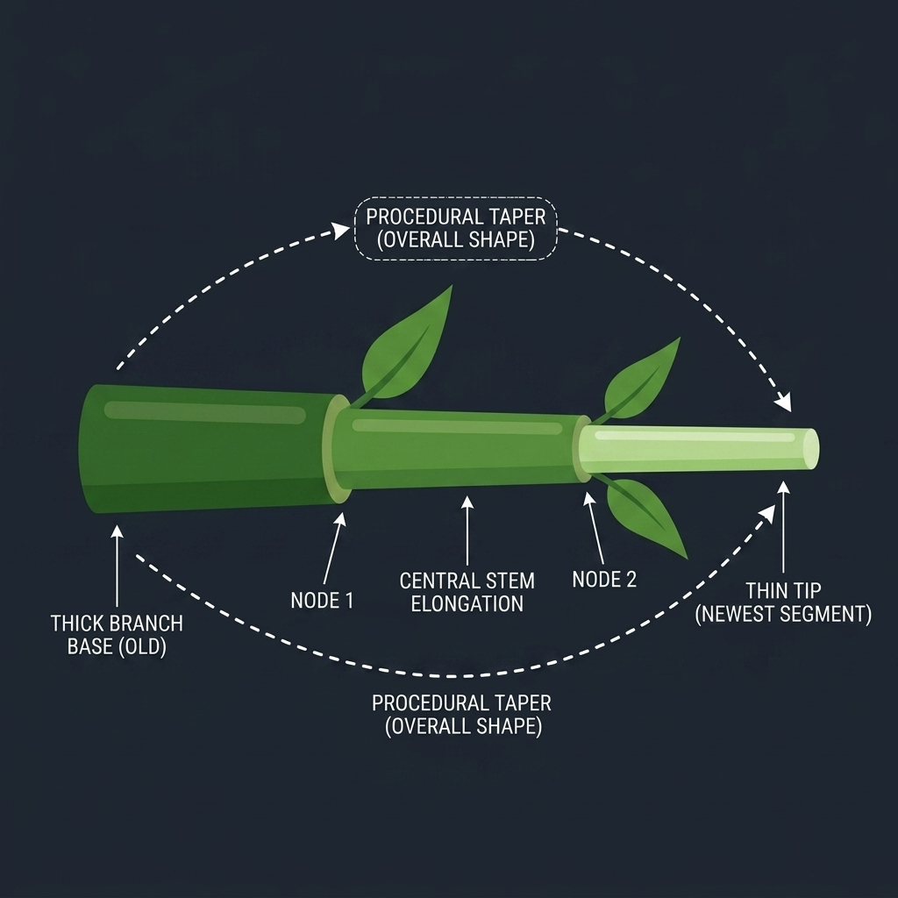

# Tapered Branch Articulation

The `add_branch` feature inside the `PlantBuilder` library provides a procedural mechanism to create physically accurate, flexible botanical structures such as petioles, pedicels, and lateral branches within Isaac Sim.

Instead of manually defining each internode in a chain, this function automates the generation of an entire articulated structure with linear interpolation for geometry, mass, and physics joint properties.



## Core Mechanics

### 1. Geometric & Physical Tapering
The function interpolates several physical properties from the base of the branch to its tip across the specified `num_segments`:
- **Radius**: Linearly scales from `start_radius` to `end_radius`.
- **Stiffness**: Linearly scales from `stiffness_base` to `stiffness_tip` (branches are naturally stiffer at the base and more flexible at the tips).
- **Damping**: Linearly scales from `damping_base` to `damping_tip` to prevent violent oscillations.

### 2. Density-Based Mass Calculation
To maintain realistic physics, the mass of each segment is not hardcoded. Instead, it is automatically derived from the segment's volume and the global `STEM_DENSITY_KG_M3`. A minimum mass floor (e.g., 50g) is enforced to ensure the PhysX mass ratio between adjacent links remains stable.

### 3. Hierarchical Articulation
- **Base Attachment**: The very first segment is attached to the `parent_id` using a D6 spherical joint. The insertion angle is dictated by `tilt_angle` (elevation) and `rot_around_parent` (azimuth).
- **Segment Chain**: Subsequent segments are chained together using similar D6 joints. 
- **Bend Limits**: The `max_bend_angle` parameter (default 30°) ensures that segments can only bend up to a realistic physiological limit, preventing branches from folding back into themselves like a wet noodle.

---

## Stability Limits & Safety Guidelines

Because PhysX relies on iterative solvers (specifically TGS in this pipeline), there are hard mathematical limits to what can be simulated stably. `add_branch` includes built-in warnings to alert the developer when these limits are breached.

### Rule 1: Chain Length Limits
**Do not exceed 10-15 segments per branch.**
*Why?* The solver accumulates error across joints. In isolated stress tests, a branch with a perfectly safe aspect ratio but consisting of 25 segments resulted in an immediate "Invalid PhysX transform" (NaN explosion). Keep segment counts low and allow Isaac Sim to interpolate the bending visually.

### Rule 2: Length-to-Diameter (L/D) Ratio
**The L/D ratio of any segment MUST remain $\ge$ 0.5 (Ideally $\ge$ 1.0).**
*Why?* If a segment becomes too "flat" (like a coin), the PhysX convex hull generation and inertia tensor calculations become highly unstable. The function will print a `[WARNING]` if the L/R (Length-to-Radius) ratio falls below 2.0.

### Rule 3: Minimum Radius Clamp
**Radius should not fall below 0.005 (5mm in baked scaling).**
*Why?* Infinitesimal collision meshes cause tunneling and solver failure. The function automatically clamps the radius at `0.005` and prints a warning if your `end_radius` violates this boundary.

---

## Usage Example

```python
# Create a 1.5m branch that gets thinner and more flexible towards the tip
tip_id = builder.add_branch(
    parent_id="Trunk_01",
    base_id="FlexBranch",
    total_length=1.5,
    start_radius=0.08,
    end_radius=0.01,
    num_segments=10,
    z_offset_ratio=0.5,
    tilt_angle=60.0,
    rot_around_parent=90.0,
    stiffness_base=50000.0,
    stiffness_tip=1000.0,
    damping_base=5000.0,
    damping_tip=100.0,
    max_bend_angle=45.0
)

# Conveniently attach a fruit directly to the returned tip ID
builder.add_fruit(tip_id, "Fruit_Flex", fruit_radius=0.1, mass=0.5)
```
