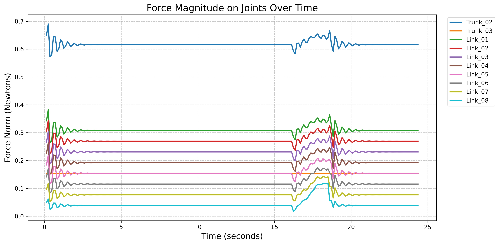

# 🍅 Procedural Articulated Tomato Branch Modeling

> **Overview**  
> A biophysically accurate, procedural pipeline for simulating tomato plant branches (*Solanum lycopersicum*) in **Isaac Sim**. Instead of using arbitrary hardcoded spring constants, joint stiffness ($K$) and damping ($D$) are dynamically derived from biological material properties using **Euler-Bernoulli Beam Theory**.

---

## 🔬 1. Physics Theory & Biological Parameter Mapping

Herbacive stems behave as elastic beams under gravity and external forces. To dynamically scale stiffness and damping with link radius and length, we map real botanical properties directly to PhysX D6 Joint Drives.

### 🌿 Material Properties (`BioConfig`)
* **Young's Modulus ($E$)**: `8.0e7` Pa ($80 \text{ MPa}$) — reflects herbaceous stem elasticity.
* **Damping Ratio ($\zeta$)**: `0.15` — underdamped regime allowing natural, biological oscillations ("traballamento").
* **Plant Density ($\rho$)**: `1000.0` $\text{kg/m}^3$ — stems consist primarily of water.

### 📐 Dynamic Physics Formulas

For a cylindrical link of radius $r$, length $L$, and volume $V = \pi r^2 L$:

1. **Mass Calculation**:
   $$M = \rho \cdot \pi r^2 L$$

2. **Second Moment of Area (Cylindrical Cross-Section)**:
   $$I = \frac{\pi r^4}{4}$$

3. **Joint Bending Stiffness ($K$)**:
   Derived from Euler-Bernoulli cantilever beam deflection ($K = \frac{E \cdot I}{L}$):
   $$K = \frac{E \cdot \pi r^4}{4 L}$$

4. **Joint Damping ($D$)**:
   Calculated to enforce the target damping ratio $\zeta$:
   $$D = 2 \cdot \zeta \cdot \sqrt{K \cdot M}$$

> 💡 **Why this matters**: If you double the radius of a branch, its bending stiffness automatically increases by $2^4 = 16\times$, matching real structural mechanics!

---

## ⚙️ 2. Isaac Sim & OpenUSD Architecture

The model is built procedurally using OpenUSD primitives (`UsdGeom.Cylinder`) and PhysX Articulation APIs.

```
/World/Stem (ArticulationRoot)
 ├── Trunk_01 (Root Link - Fixed to World)
 ├── Trunk_02 (D6 Bending Joint)
 ├── Trunk_03 (D6 Bending Joint)
 └── Branches
      └── Branch_1
           ├── Link_01 (Attachment Joint to Trunk_02)
           ├── Link_02 ... Link_08 (D6 Bending Joints)
```

### 🛠️ Key Physics Settings
* **Solver Engine**: Temporal Gauss-Seidel (**TGS**) at 120 Hz with GPU Dynamics enabled.
* **Articulation Iterations**: `Position Iteration Count = 64`, `Velocity Iteration Count = 8` (prevents joint stretching and TGS solver instabilities).
* **D6 Joint Drives**: `rotX` and `rotY` feature angular spring-drives with limits set to $\pm 20^\circ$ for trunk and $\pm 30^\circ$ for branches. `rotZ` (torsion) is locked.

---

## 📊 3. Interactive Force-Torque Diagnostics

To validate branch strength and deformation under external interaction (e.g. robotic harvesting or "poke testing"), incoming joint forces are measured at 120 Hz.

### 📉 Logging & Plotting Pipeline
1. **Real-Time Data Collection**: `load_tomato_branch.py` reads 6D force-torque vectors via `stem_articulation.get_measured_joint_forces()`.
2. **Euclidean Force Norm**:
   $$F_{\text{norm}} = \sqrt{F_x^2 + F_y^2 + F_z^2}$$
3. **Automated Visualization**: Data is saved to `data/usd_models/forces_log.csv` and plotted via `plot_forces.py`, producing `Figure_1.png`:



---

## 🚀 4. Quick Start Command

Run the complete pipeline (Generation $\rightarrow$ Simulation $\rightarrow$ CSV Logging $\rightarrow$ PNG Plot):

```bash
./src/experiments/tomato_branch_physics/run_tomato_branch_physics.sh
```

---
*Created for the AutoTom Digital Twin Project — Isaac Sim Botanical Physics Pipeline.*
