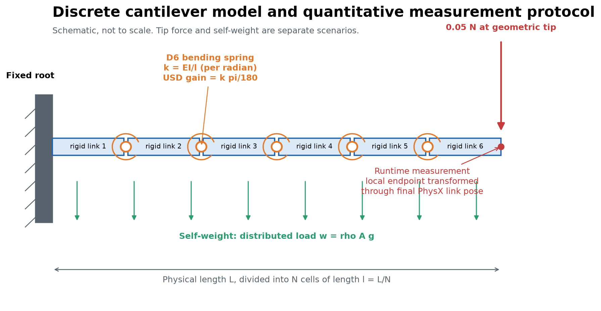
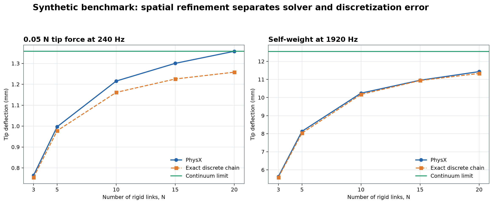
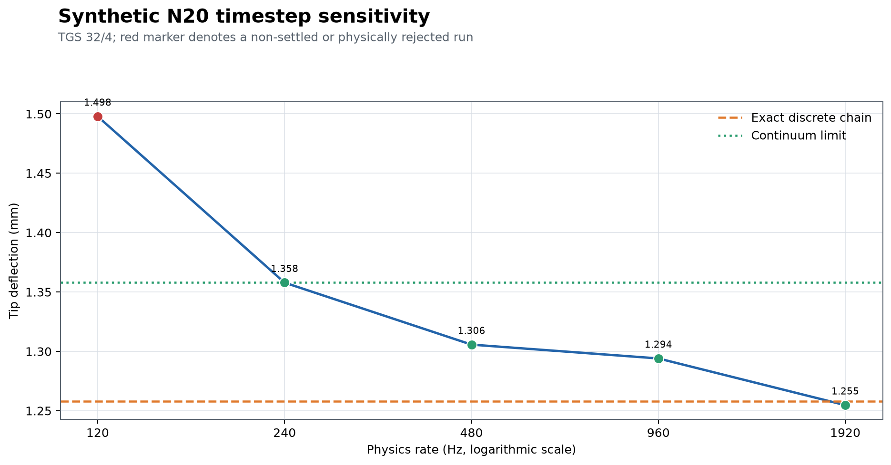
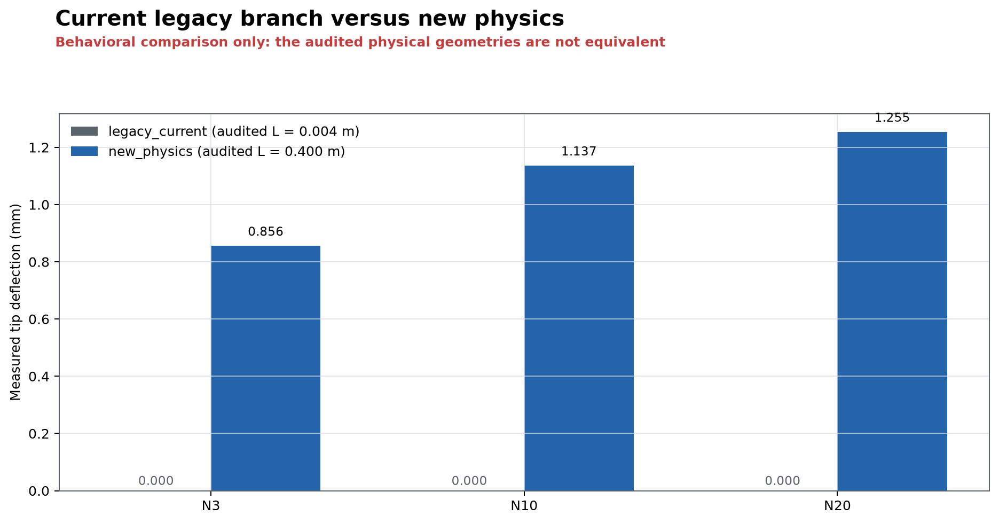
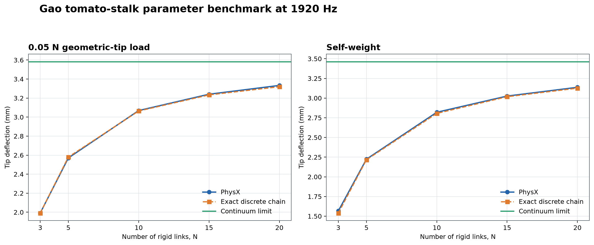

# Validation of a Discrete Cantilever Model for Plant Digital Twins

## Controlled comparison of the current legacy and new-physics branches, numerical verification in PhysX, and a tomato-stalk parameter benchmark

> **Evidence status.** The new model is verified against its matching discrete mechanics and approaches Euler-Bernoulli beam theory under spatial refinement. The Gao tomato case is a parameter-grounded plausibility test, not direct experimental validation of a living plant. The strict empirical-realism claim therefore remains blocked.

## Abstract

This experiment evaluates whether the articulated branch representation used by the digital twin has become more physically meaningful than the current `legacy_physics=True` branch. Two questions are deliberately separated: (1) does PhysX reproduce the mechanics that were authored into the rigid-link and rotational-spring model, and (2) does that discrete model approach an accepted continuum description of cantilever bending? A synthetic solid cylinder provides a controlled verification case. A hollow 20 cm tomato stalk parameterized from Gao et al. (2024) provides a biologically motivated plausibility case. Deflection is measured at the geometric end of the final link from runtime articulation transforms; initial position is recorded with gravity disabled; loads, units, topology, masses, drives, collision state, solver settings, and artifact fingerprints are audited. With TGS at 32 position and 4 velocity iterations, the synthetic N20 tip-load result at 1920 Hz is 1.2547 mm, 0.3% from the matching discrete prediction and 7.6% from the 1.3581 mm continuum limit. The Gao N20 results at 1920 Hz are 3.3330 mm under 0.05 N and 3.1372 mm under self-weight, respectively 0.4% and 0.4% from their discrete predictions and 7.0% and 9.4% from their continuum limits. The tomato tip-load result is timestep-consistent between 960 and 1920 Hz, while the 960 Hz self-weight run does not satisfy the declared settling criterion. These results support numerical and mechanical coherence of the new representation, but do not establish universal realism for living tomato plants.

## 1. Research Questions

1. Does the new branch preserve physical length, mass, and flexural rigidity when the number of links changes?
2. Does PhysX converge to the exact small-angle response of the rigid-link chain that is actually simulated?
3. Does that discrete chain converge toward Euler-Bernoulli cantilever theory as spatial resolution increases?
4. Does the current pre-change branch represent the same physical object, so that a quantitative before/after ratio is scientifically meaningful?
5. When literature-derived tomato parameters are used, is the result at least mechanically plausible and numerically reproducible?

## 2. Why This Matters for the Digital Twin

A plant digital twin needs branch compliance to represent sag, contact, grasping, support loading, and geometry changes under external forces. If stiffness depends accidentally on link count, stage units, or solver settings, the simulated response is a numerical artifact rather than a property of the plant. The model must therefore expose material parameters such as `E`, density, cross-section, and `EI`, while discretization parameters such as link count and physics rate should only control approximation error. This experiment tests that separation directly.

## 3. Physical Model

### 3.1 Geometry and material properties

Each branch is represented as a sequence of rigid cylindrical links. A hollow circular section is supported through outer radius `r_o` and inner radius `r_i`:

```text
A = pi (r_o^2 - r_i^2)
I = (pi / 4) (r_o^4 - r_i^4)
EI = E I
m_link = rho A l
```

where `l = L/N`. Total branch length and mass are consequently independent of `N` apart from serialization precision.

### 3.2 From continuum bending to rotational springs

Bending compliance is concentrated at D6 joints between adjacent rigid links. For a uniform branch, the small-rotation spring stiffness represented by one internal joint is:

```text
k_theta,rad = EI / l
k_USD = k_theta,rad (pi / 180)
```

The second conversion is essential because USD angular-drive targets and gains are expressed per degree. Therefore, increasing `N` makes each individual hinge stiffer in direct proportion to `N`; it must not leave the same drive stiffness on every discretization. The D6 joint locks translation and twist and applies identical bending drives around the two transverse axes (`d6_biaxial`). The root is a true fixed attachment in the principal experiment. This makes the first rigid cell unable to bend, so coarse chains are expected to be stiffer than the continuum. An optional `half_cell` support exists as a separately declared model, but it is not mixed into the reported fixed-root series.

### 3.3 Damping and solver role

Drive damping controls transient decay and the time needed to reach equilibrium; it should not define static compliance. The principal TGS configuration uses 32 position and 4 velocity iterations. The physics rate is varied independently. Collision shapes are disabled so that contacts cannot contaminate the bending-only benchmark.

### 3.4 Analytical references

For the continuous Euler-Bernoulli cantilever:

```text
tip force:  delta = F L^3 / (3 EI)
self-weight: delta = w L^4 / (8 EI), with w = rho A g
```

A second analytical reference is computed for the exact generated chain. For every hinge, the applied bending moment is divided by `EI/l`; the resulting rotation is propagated to the geometric tip. This discrete reference is the correct oracle for verifying PhysX. The continuum result is instead the spatial-convergence target. Agreement with the continuum alone can be accidental if numerical compliance cancels coarse-chain stiffness.



## 4. Benchmarks

| Benchmark | L (m) | Outer / inner diameter (mm) | E (MPa) | Density (kg/m3) | EI (N m2) | Self-weight continuum (mm) | 0.05 N continuum (mm) |
| --- | ---: | ---: | ---: | ---: | ---: | ---: | ---: |
| Synthetic solid cylinder | 0.40 | 20.0 / 0 | 100.00 | 1000.00 | 0.785398 | 12.5568 | 1.3581 |
| Gao tomato stalk approximation | 0.20 | 11.1 / 3.82 | 50.64 | 769.96 | 0.037207 | 3.4637 | 3.5836 |

The synthetic case is a solver and discretization benchmark, not a botanical specimen. The Gao case uses mean harvested-stalk properties and a reconstructed hollow section. It is useful for scale and consistency, but individual living plants can differ with cultivar, internode, water status, age, boundary tissue, and axial variation of `EI`.

## 5. Measurement and Audit Protocol

1. Generate every selected USD from a complete experiment configuration and store a mechanical fingerprint.
2. Audit stage units, physical branch length, total branch mass, internal and attachment stiffness, drive count, fixed support, solver iterations, backend, and disabled collisions.
3. Open the stage and initialize the articulation with gravity disabled.
4. Measure the undeformed geometric tip by transforming local point `(0, 0, link_height)` through the final runtime PhysX link transform. This is neither a USD default-time transform nor the final-link center of mass.
5. For tip loading, keep gravity disabled and apply 0.05 N at the geometric tip through the articulation tensor API, including the corresponding moment arm.
6. For self-weight, enable 9.81 m/s2 gravity and apply no external force.
7. Sample vertical deflection at a declared rate. Declare settling only when the range over the final time window is below the tolerance; impose a maximum simulated duration and preserve `not_settled` rather than accepting the last value silently.
8. Compare first to the exact discrete-chain reference and then to the continuum limit.

The primary CPU experiments use TGS, 32/4 solver iterations, fixed root, biaxial D6 joints, no collisions, geometric-tip loading, and explicit physics rates. A result is not a pass merely because it is stable: a stable but incorrect equilibrium is labelled `settled_wrong_equilibrium`.

## 6. Debugging Controls

The initial high-N anomaly was real but was not evidence that long articulated chains are intrinsically unsupported by PhysX. A single-hinge N2 control isolated the cause. With the previous 255-position-iteration setting, D6 became strongly timestep dependent and could lock at zero displacement. A revolute joint at the same 480 Hz reproduced the analytical displacement, proving that force application and tip measurement were active. Reducing TGS to 32 position and 4 velocity iterations restored D6 behavior.

| Joint / iterations | 120 Hz error | 240 Hz error | 480 Hz error | Diagnostic conclusion |
| --- | ---: | ---: | ---: | --- |
| D6 planar, 255/4 | 0.5% | 43.9% | 100.0% (locked) | pathological timestep response |
| Revolute planar, 255/4 | n/a | n/a | 0.2% | load and measurement control passed |
| D6 planar, 32/4 | 2.6% | 0.6% | 4.1% | passed |
| D6 biaxial, 32/4 | 2.6% | 0.6% | 4.1% | passed |

> The diagnostic values above are retained as protocol observations from the solver-isolation runs. The aggregate acceptance dataset uses the corrected 32/4 configuration.

## 7. Results

### 7.1 Artifact integrity

All reported new-physics USD files passed their configuration fingerprints. For the synthetic branch, audited physical length was 0.400000 m and mass approximately 0.125664 kg for every N. For Gao, length was 0.200000 m and mass approximately 0.013137 kg for every N. Internal USD drive stiffness increased from 0.102808 N m/deg at N3 to 0.685389 N m/deg at N20 for the synthetic case, and from 0.009741 to 0.064938 N m/deg for Gao, exactly as required by `EI/l` and the degree conversion.

### 7.2 Synthetic spatial convergence: 0.05 N tip force at 240 Hz

| N | Rate (Hz) | Measured (mm) | Discrete reference (mm) | Discrete error | Continuum reference (mm) | Continuum error | Settled | Status |
| ---: | ---: | ---: | ---: | ---: | ---: | ---: | :---: | --- |
| 3 | 240 | 0.7640 | 0.7545 | 1.3% | 1.3581 | 43.7% | yes | passed |
| 5 | 240 | 0.9969 | 0.9778 | 1.9% | 1.3581 | 26.6% | yes | passed |
| 10 | 240 | 1.2155 | 1.1612 | 4.7% | 1.3581 | 10.5% | yes | passed |
| 15 | 240 | 1.3002 | 1.2253 | 6.1% | 1.3581 | 4.3% | yes | passed |
| 20 | 240 | 1.3579 | 1.2580 | 7.9% | 1.3581 | 0.0% | yes | passed |

PhysX follows the matching discrete model at every spatial resolution. The apparent increase in discrete error with N at 240 Hz is numerical compliance, while the discrete topology itself approaches the 1.3581 mm continuum limit. At N20 the measured value happens to be almost equal to the continuum value even though it is 7.9% above the discrete prediction; this is an example of error cancellation and is why both references are reported.

### 7.3 Synthetic spatial convergence: self-weight at 1920 Hz

| N | Rate (Hz) | Measured (mm) | Discrete reference (mm) | Discrete error | Continuum reference (mm) | Continuum error | Settled | Status |
| ---: | ---: | ---: | ---: | ---: | ---: | ---: | :---: | --- |
| 3 | 1920 | 5.6305 | 5.5808 | 0.9% | 12.5568 | 55.2% | yes | passed |
| 5 | 1920 | 8.1316 | 8.0364 | 1.2% | 12.5568 | 35.2% | yes | passed |
| 10 | 1920 | 10.2421 | 10.1710 | 0.7% | 12.5568 | 18.4% | yes | passed |
| 15 | 1920 | 10.9553 | 10.9384 | 0.2% | 12.5568 | 12.8% | yes | passed |
| 20 | 1920 | 11.4321 | 11.3325 | 0.9% | 12.5568 | 9.0% | yes | passed |

At 1920 Hz every self-weight result agrees closely with its discrete reference. N20 reaches 11.4321 mm, 0.9% from the discrete chain and 9.0% from the 12.5568 mm continuum limit. The remaining continuum difference is principally the fixed-root discretization error.



### 7.4 Synthetic N20 timestep sensitivity: 0.05 N tip force

| N | Rate (Hz) | Measured (mm) | Discrete reference (mm) | Discrete error | Continuum reference (mm) | Continuum error | Settled | Status |
| ---: | ---: | ---: | ---: | ---: | ---: | ---: | :---: | --- |
| 20 | 120 | 1.4979 | 1.2580 | 19.1% | 1.3581 | 10.3% | yes | settled_wrong_equilibrium |
| 20 | 240 | 1.3579 | 1.2580 | 7.9% | 1.3581 | 0.0% | yes | passed |
| 20 | 480 | 1.3057 | 1.2580 | 3.8% | 1.3581 | 3.9% | yes | passed |
| 20 | 960 | 1.2940 | 1.2580 | 2.9% | 1.3581 | 4.7% | yes | passed |
| 20 | 1920 | 1.2547 | 1.2580 | 0.3% | 1.3581 | 7.6% | yes | passed |

The response is not timestep independent over the entire 120-1920 Hz range. It converges toward the discrete equilibrium as the timestep is reduced: 960 and 1920 Hz differ by 0.0393 mm, or 3.1% of the discrete reference, satisfying the declared finest-pair 5% criterion. The 120 Hz run settles at an incorrect equilibrium and must not be used quantitatively.



### 7.5 Current legacy branch versus new physics

| Model branch | N | Audited physical length (m) | Measured deflection (mm) | Interpretation |
| --- | ---: | ---: | ---: | --- |
| `legacy_current` | 3 | 0.004000 | 0.0000 | not physically equivalent; stage-scale baseline |
| `legacy_current` | 10 | 0.004000 | 0.0000 | not physically equivalent; stage-scale baseline |
| `legacy_current` | 20 | 0.004000 | 0.0000 | not physically equivalent; stage-scale baseline |
| `new_physics` | 3 | 0.400000 | 0.8561 | settled_wrong_equilibrium |
| `new_physics` | 10 | 0.400000 | 1.1368 | passed |
| `new_physics` | 20 | 0.400000 | 1.2547 | passed |

The comparison demonstrates a major behavioral correction, but it is not an apples-to-apples physical material comparison. The current `legacy_physics=True` branch authors `metersPerUnit = 0.01`; its nominal 40 cm geometry is therefore audited as a 4 mm physical branch while retaining approximately the same authored mass and drive stiffness. Its near-zero deflection is consequently not evidence of a stiffer real stem. It is evidence that the old current branch does not encode the intended SI-scale object. `legacy_current` is also not a frozen historical release, so no claim is made about every past implementation.



### 7.6 Gao tomato-stalk spatial convergence at 1920 Hz

#### 0.05 N geometric-tip load

| N | Rate (Hz) | Measured (mm) | Discrete reference (mm) | Discrete error | Continuum reference (mm) | Continuum error | Settled | Status |
| ---: | ---: | ---: | ---: | ---: | ---: | ---: | :---: | --- |
| 3 | 1920 | 1.9915 | 1.9909 | 0.0% | 3.5836 | 44.4% | yes | passed |
| 5 | 1920 | 2.5705 | 2.5802 | 0.4% | 3.5836 | 28.3% | yes | passed |
| 10 | 1920 | 3.0688 | 3.0640 | 0.2% | 3.5836 | 14.4% | yes | passed |
| 15 | 1920 | 3.2406 | 3.2332 | 0.2% | 3.5836 | 9.6% | yes | passed |
| 20 | 1920 | 3.3330 | 3.3193 | 0.4% | 3.5836 | 7.0% | yes | passed |

#### Self-weight

| N | Rate (Hz) | Measured (mm) | Discrete reference (mm) | Discrete error | Continuum reference (mm) | Continuum error | Settled | Status |
| ---: | ---: | ---: | ---: | ---: | ---: | ---: | :---: | --- |
| 3 | 1920 | 1.5666 | 1.5394 | 1.8% | 3.4637 | 54.8% | yes | passed |
| 5 | 1920 | 2.2243 | 2.2167 | 0.3% | 3.4637 | 35.8% | yes | passed |
| 10 | 1920 | 2.8199 | 2.8056 | 0.5% | 3.4637 | 18.6% | yes | passed |
| 15 | 1920 | 3.0258 | 3.0172 | 0.3% | 3.4637 | 12.6% | yes | passed |
| 20 | 1920 | 3.1372 | 3.1260 | 0.4% | 3.4637 | 9.4% | yes | passed |

At N20 the tip-force result is 3.3330 mm versus 3.3193 mm for the discrete chain and 3.5836 mm for the continuum. The self-weight result is 3.1372 mm versus 3.1260 mm discrete and 3.4637 mm continuum. Thus PhysX error is below 0.5% against the authored discrete mechanics, while the fixed-root chain remains approximately 7.0% and 9.4% stiffer than the continuum, respectively.



### 7.7 Gao N20 timestep check

| N | Rate (Hz) | Measured (mm) | Discrete reference (mm) | Discrete error | Continuum reference (mm) | Continuum error | Settled | Status |
| ---: | ---: | ---: | ---: | ---: | ---: | ---: | :---: | --- |
| 20 | 960 | 3.3465 | 3.3193 | 0.8% | 3.5836 | 6.6% | yes | passed |
| 20 | 1920 | 3.3330 | 3.3193 | 0.4% | 3.5836 | 7.0% | yes | passed |
| 20 | 960 | 3.1725 | 3.1260 | 1.5% | 3.4637 | 8.4% | no | not_settled |
| 20 | 1920 | 3.1372 | 3.1260 | 0.4% | 3.4637 | 9.4% | yes | passed |

The Gao tip-load values at 960 and 1920 Hz differ by only 0.0135 mm, about 0.4% of the discrete reference, and both runs settle. The 960 Hz self-weight value is close to the 1920 Hz result but does not satisfy the settling criterion within the maximum duration. Closeness of two final samples is not substituted for convergence; the self-weight timestep-independence criterion therefore remains failed.

## 8. Acceptance Summary

- Synthetic solver/model validation: **yes**.
- Gao parameter-grounded N20 validation: **yes**.
- Gao tip-force timestep validation: **yes**.
- Gao self-weight timestep validation: **no**.
- Direct tomato empirical ground truth present: **no**.
- Unqualified tomato-realism claim allowed: **no**.

## 9. Interpretation

The new formulation is demonstrably more physically coherent than the current legacy branch. It preserves the intended SI-scale geometry, computes mass from a declared section and density, maps `EI` to link-dependent angular stiffness, applies force at the true geometric tip, and converges to an analytical discrete model. The tests also show that PhysX can reproduce the intended N20 mechanics when the solver configuration and timestep are appropriate; the earlier high-N divergence was not a universal articulation limit.

The experiment does not show that one timestep is adequate for every branch or load. N20 self-weight is more demanding than tip loading and required 1920 Hz to satisfy the present settling rule within the tested duration. Coarser rates may still be useful for interactive operation, but their equilibrium and transient errors must be characterized for the intended task.

The Gao case supports plausibility at the correct order of magnitude and shows that the implementation can carry literature-derived geometry, density, and modulus consistently. It does not validate a specific living plant because no matched specimen, clamp condition, moisture state, axial `EI` profile, or measured force-deflection curve was supplied.

## 10. Limitations and Threats to Validity

- Euler-Bernoulli theory assumes small deformation, linear elasticity, uniform material, and negligible shear deformation. The reported deflections are small enough for a useful first benchmark, but real stems can be anisotropic, viscoelastic, tapered, pre-curved, and heterogeneous.
- Gao et al. studied harvested stalk segments for a DEM context. The mean parameters are not universal tomato-stem constants.
- The root is ideally fixed. Clamp compliance and the missing half-cell bending compliance affect coarse discretizations.
- Static deflection does not validate transient frequency, damping, fracture, plasticity, contact, or growth response.
- Collisions are deliberately disabled. Contact-rich digital-twin tasks require a separate validation after the bending-only mechanics pass.
- Only CPU TGS is accepted here. GPU dynamics and other solver types need independent sweeps.
- The pre/post baseline is the current legacy code path, not a versioned historical artifact, and its physical scale differs by 100 times.
- The 960 Hz Gao self-weight run is not settled; this remains a visible negative result.

## 11. Conclusions

1. **The new physical modelling is materially better than the current legacy branch.** The principal improvement is correct physical scaling and an explicit `EI`-preserving discretization, not merely a tuned deflection value.
2. **The corrected PhysX setup reproduces the authored discrete mechanics.** At high resolution and 1920 Hz, synthetic and Gao N20 errors against the exact discrete references are below 1% for the reported settled cases.
3. **Spatial refinement behaves as expected.** Fixed-root chains are too stiff at low N and approach the continuum as N increases.
4. **Numerical settings remain part of the model contract.** Excessive TGS position iterations produced a false locked equilibrium, and low rates can produce stable but incorrect results.
5. **The tomato result is promising but qualified.** It is a literature-parameter plausibility benchmark, not empirical validation of a living tomato plant. A direct force-deflection experiment on a matched specimen is the next required evidence for a realism claim.

## 12. Reproducibility

Run all commands from the repository root. Pure Python checks use `uv run`; USD generation and simulation use the Isaac Sim interpreter.

```bash
UV_CACHE_DIR=/tmp/uv-cache uv run python -m pytest src/exporterV2/tests/cantilever_bending_experiment/test_validation_protocol.py -q
UV_CACHE_DIR=/tmp/uv-cache uv run python src/exporterV2/tests/cantilever_bending_experiment/cantilever_validation.py formula-check
./src/exporterV2/tests/cantilever_bending_experiment/run_paper_experiment.sh
```

The full script regenerates USD artifacts, starts a new aggregate dataset, appends each declared experiment, recomputes acceptance, and regenerates this report and its figures. Machine-readable evidence is stored in `results/cantilever_validation_results.json`, measurements in `results/cantilever_validation_measurements.csv`, and the most recent isolated Isaac run in `results/cantilever_validation_last_run.json`.

## 13. Notion Import and Figure Placement

This file uses standard Markdown headings, tables, block quotes, lists, and fenced code blocks. For Notion, import this Markdown file and upload the PNG files from `docs/assets/` where the relative image placeholders appear. Recommended placement:

- `fig01_physical_model.png`: after Section 3.4.
- `fig02_synthetic_spatial_convergence.png`: after Section 7.3.
- `fig03_timestep_sensitivity.png`: after Section 7.4.
- `fig04_pre_post.png`: after Section 7.5.
- `fig05_gao_convergence.png`: after Section 7.6.

## References

1. Gao et al. (2024), [Discrete Element Model Building and Optimization of Tomato Stalks at Harvest](https://www.mdpi.com/2077-0472/14/4/531).
2. OpenUSD, [UsdPhysicsDriveAPI documentation](https://openusd.org/release/api/class_usd_physics_drive_a_p_i.html).
3. Coutand et al., [Biomechanical study of controlled bending on tomato stem elongation](https://pubmed.ncbi.nlm.nih.gov/11113160/).
4. Martin-Nelson et al. (2021), [Axial variation in flexural stiffness of plant stem segments](https://ouci.dntb.gov.ua/en/works/l1pMrXo4/).

## Appendix A. Evidence Artifacts

- `cantilever_validation.py`: generation, audit, simulation, measurement, acceptance, and serialization.
- `test_validation_protocol.py`: pure-Python tests for formulas, unit conversion, topology, fingerprints, merge semantics, and acceptance logic.
- `results/cantilever_validation_results.json`: aggregate source of truth used to generate tables and figures.
- `results/cantilever_validation_measurements.csv`: flat measurement export.
- `results/cantilever_validation_last_run.json`: overwrite-safe checkpoint for the latest Isaac invocation.
- `data/usd_models/physics_tests/`: generated USD evidence artifacts.
